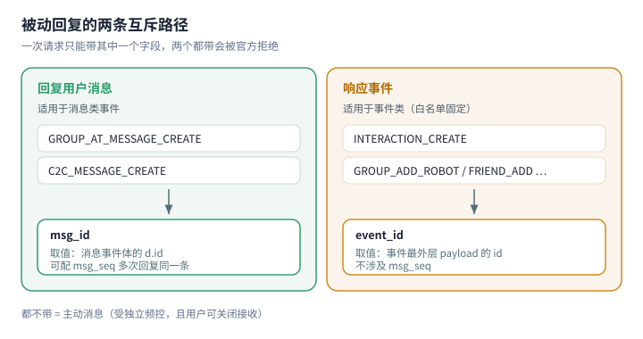

# 收发消息

## 被动回复用 `msg_id` 还是 `event_id`

官方把被动消息分成**两条互斥的路径**。选错了请求会被直接拒绝。

| 路径 | 触发事件 | 携带字段 | 取值来源 |
| --- | --- | --- | --- |
| **回复用户消息** | `GROUP_AT_MESSAGE_CREATE`、`C2C_MESSAGE_CREATE` | `msg_id` | 消息事件体的 `d.id` |
| **响应事件** | `INTERACTION_CREATE`、`GROUP_ADD_ROBOT`、`C2C_MSG_RECEIVE`、`FRIEND_ADD` | `event_id` | 事件**最外层 payload 的 `id`** |

官方对 `is_wakeup` 的字段说明直接写着「与 `msg_id`，`event_id` 互斥使用」。
**回复一条消息时只带 `msg_id`**；把 `event_id` 一起带上属于非法请求。



::: danger 这是本项目真实踩过的坑

早期版本里，指令引擎同时传了 `msgId` 与 `eventId`，于是**每一次被动回复
都被本地校验收掉**，日志里是：

```
指令回复发送失败：消息内容不合法：msg_id 与 event_id 只能二选一
```

用户看到的现象是「机器人完全不回复指令」。修法不是「少传一个参数」，
而是把选择收进一个类型：构造入口只有 `PassiveCredential.message(id)`
与 `PassiveCredential.event(id)`，**两者在类型层面就无法同时出现**。

:::

## `msg_seq`：对同一条消息回复多次

官方原话：「回复消息的序号，**与 `msg_id` 联合使用**，避免相同消息 id 回复重复发送，
不填默认是 1。**相同的 `msg_id` + `msg_seq` 重复发送会失败**」。

因此：

- 对同一条消息要回复第 2 次，必须把 `msg_seq` 递增；
- **只在携带 `msg_id` 时才输出该字段**——官方参数表在 `event_id` 路径下没有定义它。

## 被动回复的时间窗口与次数上限

| 场景 | 有效期 | 每条消息可回复次数 |
| --- | --- | --- |
| 单聊 | 60 分钟 | 4 次 |
| 群聊 | **5 分钟** | 5 次 |

::: warning 官方文档自己有两处冲突

- 次数：`overview.html` 写单聊 **4 次**，`send.html` 正文写 5 次，
  但同一页 2026/01/10 的更新说明写「由 60 分钟 5 次调整为 60 分钟 4 次」。
  本项目取**保守值 4**。
- 有效期：`send.html` 顶部写「被动消息有效期 60 分钟」，
  字段说明又写「`msg_id` 5 分钟内有效」。本项目按场景分别使用 60 / 5 分钟，
  并把「5 分钟」当作「尽快回复」的提示阈值。

:::

超时或超次的失败表现：`304027 MSG_EXPIRE 回复的消息过期`、
`304026 MSG_ID 回复的消息 id 错误`、`40034005 回复消息 msg_id 已过期`。

### 窗口关闭后怎么办

本项目**不放弃回复**，而是改发**主动消息**，并记一条 WARN 说明降级原因
（窗口过期 / 次数用尽 / 事件里没有 `msg_id`）。

选择这么做的理由：主动消息是官方支持的正常路径，只是约束不同——
受独立频控、且用户可以在 QQ 客户端关闭「允许主动发送」。
相比「静默不回」，把话发出去更符合预期；而相比「静默改发」，
留一条日志才能让人日后想明白「这条到底是不是被动回复」。

## 主动消息

不带 `msg_id` 也不带 `event_id` 即为主动消息。约束：

| 认证类型 | 场景 | Bot 维度频控 | 单关系维度频控 | 每日上限 |
| --- | --- | --- | --- | --- |
| 企业 / 个人认证 | 单聊 | 10 qps | 20 qpm | 1000 条/用户 |
| 未认证 | 单聊 | 5 qps & 30 qpm | 20 qpm | 1000 条/用户 |
| 企业 / 个人认证 | 群聊 | 60 qpm | 20 qpm | 1000 条/群 |
| 未认证 | 群聊 | 30 qpm | 20 qpm | 1000 条/群 |

::: info 两个必须知道的前提

1. **用户可以关闭主动消息**。用户（或群管理员）在机器人资料页关掉开关后，
   主动消息一律发送失败。开关状态会通过 `C2C_MSG_REJECT` / `GROUP_MSG_REJECT`
   等事件通知，本项目的会话摘要上会显示「主动消息已关闭」。
2. **群场景主动推送需要群主开启设置项**。官方在 2026/06/22 的更新说明里
   明确了这一点：群主主动打开「机器人主动在群聊内发言」之后，机器人才
   可以对该群下发主动消息。

:::

## 互动召回消息（仅单聊）

`is_wakeup = true` 时为互动召回消息，与 `msg_id` / `event_id` 互斥。
官方原文：在用户主动与机器人对话之后，机器人在**未来 30 天内**可下发召回消息，
每个周期内可下发一条，周期划分为当天、1–3 天、3–7 天、7–30 天，合计 4 个周期。

## 富媒体

- **单聊与群聊的上传接口相互独立**，同一份文件不能跨场景复用
  （`/v2/users/{user_openid}/files` 与 `/v2/groups/{group_openid}/files`）；
- 官方支持的类型：图片 `png` / `jpg`、视频 `mp4`、语音 `silk`，其余按「文件」处理；
- 大文件走**分片上传**：预上传 → 逐块上传 → 完成通知；
- 本项目的图片发送路径会自动压到 1600px 宽、质量 88 再上传，显著降低失败率。

::: info 历史消息里为什么没有图片

官方附件 URL 带签名且会过期，落盘存下来只会得到一堆失效链接，
反而让人以为「消息坏了」。因此历史只保留文本、官方消息 id、
发送者身份、@ 到的人，以及被引用的那条消息。

:::

## 会话页怎么渲染一条消息

官方把「@某人」「表情」这类内容以**内嵌标签**写在正文里（`text-chain` 能力），
而不是放在独立字段中，所以一条群聊消息的 `content` 长这样：

```
<@CA87605D7C22D7BA4863B86754D1876D> 你看这个 <faceType=6,faceId="0",ext="...">
```

原样显示出来就是两串看不懂的字符。会话页会先把正文切成片段再渲染：

| 元素 | 官方格式 | 渲染为 |
| --- | --- | --- |
| @某人 | `<qqbot-at-user id="" />` 或旧写法 `<@userid>` | `@昵称`（昵称取自事件的 `mentions`） |
| @全部成员 | `<qqbot-at-everyone />` | `@全体成员` |
| 表情 | `<faceType=6,faceId="0",...>`（**官方文档未收录**）、`<emoji:id>` | `[表情]` |
| 指令标签 | `<qqbot-cmd-enter text="" />`、`<qqbot-cmd-input ... />` | `/文本` |
| 子频道 | `<#channel_id>` | `#…尾号` |
| 其它 `qqbot-*` 标签 | — | `[元素]` |

两点必须说明清楚：

- **官方没有说明正文里的占位符与 `mentions` 元素如何对应**。本项目把每个被 @
  用户的 `id` / `member_openid` / `user_openid` / `union_openid` 都登记成一个
  索引，正文里出现哪一个都能命中；匹配不上时显示 `@某人`，而不是把 openid
  露出来。
- **`faceType` 这种形式不在官方文档里**，是实测抓到的（`ext` 是
  `{"text":""}` 的 base64）。官方没有给 `faceId` 到表情图片的映射表，
  因此本项目不去猜图片地址，只渲染成一个中性标签。

非图片附件（语音 / 视频 / 文件）同样会渲染：官方的 `url` 是带签名的
**下载**链接，不能直接播放，因此给的是「类型 + 文件名 + 体积」，
语音另附一行官方 ASR 识别文本（并标明是机器识别）。

引用消息（`message_type = 103`）会渲染成引用块。注意 `msg_elements`
**只在 103 时表示「被引用的内容」**：101（并行消息）与 102（聊天记录）
带 `msg_elements` 时那是本条消息自己的内容，本项目不会把它标成引用。

## 引用回复

`message_reference.message_id` 取值为 `REFIDX_xxxxxx` 形式，两条取值路径：

- 非机器人发的消息：从消息事件 `message_scene.ext` 的 `msg_idx` 取；
- 机器人自己发的消息：从发消息接口响应的 `ext_info.ref_idx` 取。

本项目用前者做**去重键**（官方明确「相同 `msg_id` 可能重复推送」，
需结合 `msg_idx` 去重），因此重复推送只会被处理一次。

## 撤回

`DELETE /v2/users/{openid}/messages/{message_id}` 与群聊同名接口，
限频 10 QPS，**发送超过 2 分钟的消息不可撤回**。
